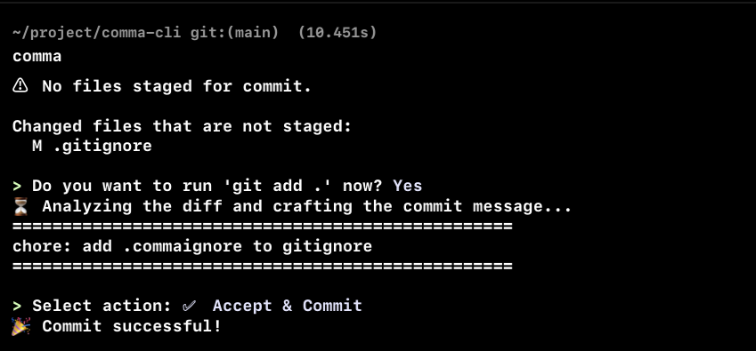
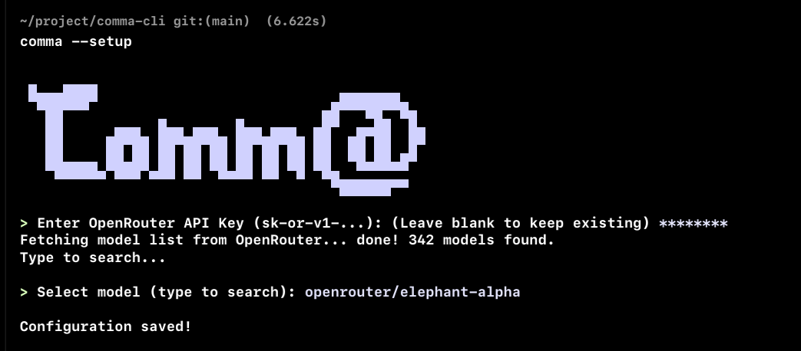

# comma

> Your commit history deserves better than `fix stuff`.

[](https://crates.io/crates/git-comma)
[](LICENSE)
[](https://www.rust-lang.org/)

`comma` reads your staged diff, sends it to any AI model on [OpenRouter](https://openrouter.ai), and hands you a clean, conventional commit message. Accept it, edit it, regenerate it — then commit. That's it.

---

## Demo

**Running `comma`:**



**Running `comma --setup`:**



---

## Why comma?

Writing good commit messages is hard and slow. `comma` makes it instant without locking you into a single AI provider. You pick the model — GPT-4o, Claude, Mistral, Llama, whatever — via OpenRouter. One tool, every model, zero vendor lock-in.

---

## Installation

### Via cargo

```bash
cargo install git-comma
```

### From source

```bash
git clone https://github.com/rfxlamia/git-comma
cd git-comma
cargo build --release
# Binary at: ./target/release/comma
```

---

## Quick Start

**First run:** comma will walk you through setup automatically.

```bash
comma
```

You'll be prompted for your [OpenRouter API key](https://openrouter.ai/keys) and asked to pick a model. Config is saved to `~/.comma.json` — you never see the setup screen again unless you want to.

**Reconfigure anytime:**

```bash
comma --setup
```

---

## How It Works

```
git add <files>   →   comma   →   AI reads your diff
                                        ↓
                          ┌─────────────────────────┐
                          │  feat: add user auth     │
                          │                          │
                          │  - JWT-based middleware  │
                          │  - Session persistence   │
                          └─────────────────────────┘
                                        ↓
                    ✅ Accept  ✏️ Edit  🔄 Regenerate  ❌ Cancel
```

1. **Preflight** — validates git repo, checks staged files, warns about huge diffs
2. **AI engine** — sends your diff to OpenRouter with a carefully tuned system prompt
3. **Action loop** — you choose what to do with the result
4. **Commit** — draft saved to `.git/comma_msg.txt` first (survives hook failures)

---

## Features

- **Any model on OpenRouter** — GPT-4o, Claude, Mistral, Gemini, Llama, and hundreds more
- **Conventional Commits** — output follows `feat/fix/refactor/chore/docs/...` format
- **Smart staging** — no staged files? comma offers to run `git add .` for you
- **Large diff guard** — warns if diff exceeds 15,000 chars (you can still proceed)
- **Regenerate with instruction** — not happy? Tell it what to change: "make it shorter" or "focus on the auth changes"
- **Model switch on failure** — rate limited or model unavailable? Switch models inline without restarting
- **Safety net** — draft always saved to `.git/comma_msg.txt` before commit attempt; survives pre-commit hook failures
- **Secure config** — `~/.comma.json` written with `0o600` permissions and atomic rename (no partial writes)

---

## Actions

After the AI generates a message, you pick:

| Action | What happens |
|--------|-------------|
| ✅ Accept & Commit | Commits immediately using the generated message |
| ✏️ Edit Manual | Opens your `$EDITOR` with the draft pre-filled |
| 🔄 Regenerate | Re-generates; optionally with a custom instruction |
| ❌ Cancel | Exits cleanly, nothing committed |

---

## Configuration

Config lives at `~/.comma.json`:

```json
{
  "api_key": "sk-or-v1-...",
  "model_id": "openai/gpt-4o"
}
```

Run `comma --setup` to change either value interactively. You can also type a model ID manually (useful for models not yet listed in the API).

---

## Error Recovery

comma doesn't give up easily:

- **Rate limited / model unavailable** — prompts to switch model; retries up to 3 times
- **Network error** — falls back to `$EDITOR` so you can write manually
- **Empty AI response** — same editor fallback
- **Pre-commit hook failure** — commit message is safe in `.git/comma_msg.txt`; run `git commit -F .git/comma_msg.txt` after fixing the hook

---

## Dependencies

| Crate | Purpose |
|-------|---------|
| `clap` | CLI argument parsing |
| `inquire` | Interactive prompts and editor integration |
| `ureq` | HTTP client for OpenRouter API |
| `serde` / `serde_json` | Config and API payload serialization |
| `colored` | Terminal colors |
| `thiserror` | Ergonomic error types |
| `home` | Cross-platform home directory |

---

## Building & Testing

```bash
cargo build          # debug build
cargo build --release
cargo test           # all tests
cargo test -- --nocapture  # with output
```

---

## License

MIT — see [LICENSE](LICENSE).

---

*Built in Rust. Commits written by AI. Decisions made by you.*
